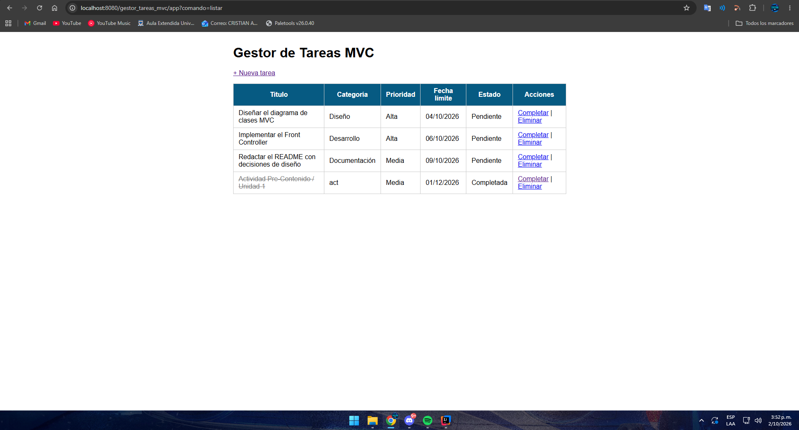
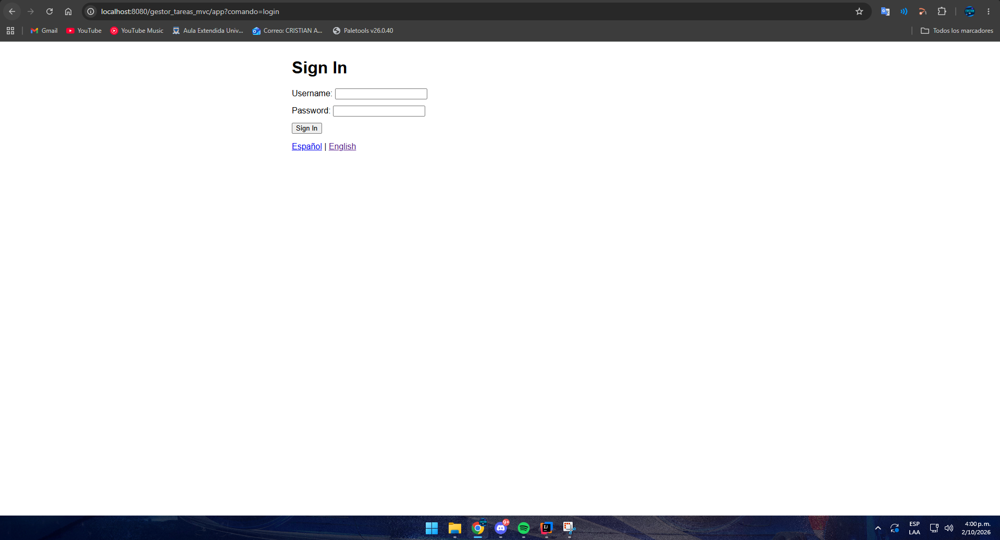
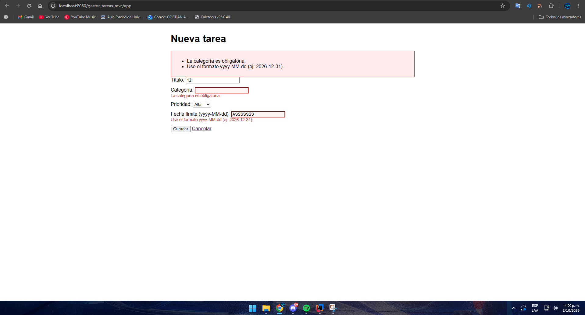
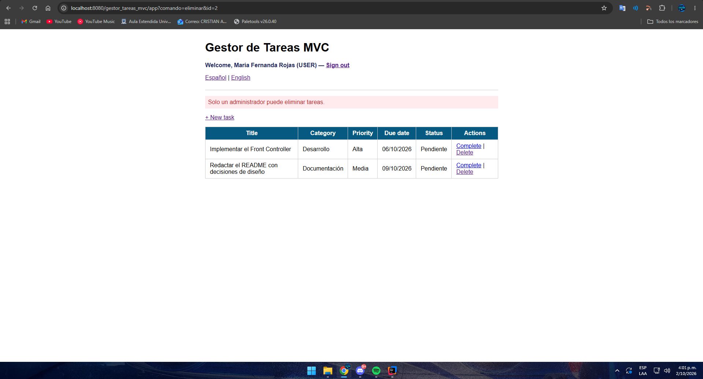

# Post-contenido — Unidad 6: JSP con MVC

**Autor:** Cristian Alonso Peñaranda Parra
**Curso:** Programación Web — Universidad de Santander (UDES)

## Descripción
Repositorio del laboratorio de la Unidad 6 de Programación Web.
Contiene un único proyecto Maven Web (`gestor-tareas-mvc`, en la raíz del
repositorio) que formaliza el patrón MVC con un Front Controller y el
patrón Comando, extendido con autenticación por sesión con roles,
validación por campo e internacionalización.

**Tecnologías:** Java 17, Jakarta Servlet 6.0, JSP, JSTL 3.0, Maven,
Apache Tomcat 10.1.

## Prerrequisitos
- JDK 17 o superior en el PATH.
- Apache Tomcat 10.1.x (puerto 8080 disponible).
- Maven 3.8+ (o el integrado en IntelliJ IDEA).
- IntelliJ IDEA (o Eclipse IDE for Enterprise Java Developers).
- Git.

## Funcionalidades implementadas
- CRUD de tareas (listar, crear, completar, eliminar) con el patrón
  Post/Redirect/Get.
- Front Controller único en `/app` que delega en objetos Comando.
- Login y logout con `HttpSession`, con tiempo de inactividad de 30 minutos.
- Verificación de sesión centralizada en el Front Controller.
- Roles ADMIN y USER: solo ADMIN puede eliminar tareas.
- Validación en el servidor con mensajes específicos por campo y
  repoblado del formulario.
- Selector de idioma (español/inglés) persistido en cookie, con
  `ResourceBundle`.
- Configuración global (nombre de la aplicación y longitud máxima del
  título) leída desde `web.xml` al contexto de aplicación.

## Parte 1 — Front Controller y patrón Comando
`FrontControllerServlet` es el único punto de entrada (`/app`) y delega
en objetos Comando (`ListarComando`, `FormularioComando`,
`GuardarComando`, `EliminarComando`, `CompletarComando`). `TareaService`
y `TareaDAO` separan la lógica de negocio y el acceso a datos del
Controlador. Las vistas usan JSTL y Expression Language, sin scriptlets.



## Parte 2 — Sesión con roles, validación por campo e i18n
`FrontControllerServlet` centraliza la verificación de sesión antes de
resolver cualquier comando protegido. `LoginComando` y `LogoutComando`
gestionan `HttpSession` con roles ADMIN/USER; `EliminarComando` solo
permite el rol ADMIN. `GuardarComando` valida cada campo por separado,
usando el límite de longitud del título leído del contexto de aplicación.
`IdiomaComando` guarda la preferencia de idioma en una cookie, leída en
las vistas con el objeto EL implícito `cookie` y `ResourceBundle`
(`messages.properties`, `messages_en.properties`, `messages_es.properties`).

Usuarios de prueba: `admin` / `Admin123!` (ADMIN) y `maria` /
`Maria2026!` (USER).






## Decisiones de diseño
- **El Comando devuelve la vista lógica, no hace el forward:** cada
  Comando devuelve la ruta de la vista (o `null` si ya hizo un
  redirect) para que `FrontControllerServlet` concentre el forward en un
  solo lugar y pueda aplicar lógica común antes o después de ejecutar
  cualquier comando.
- **Front Controller en vez de un Servlet por acción:** toda petición
  pasa por un único método `procesar()`, por lo que la verificación de
  sesión de la Parte 2 se escribió una sola vez. Con un Servlet por
  acción habría que copiarla al inicio de cada uno.
- **Verificación de sesión centralizada:** solo `login` e `idioma` son
  públicos. Cualquier comando nuevo queda protegido automáticamente.
- **Usuario y rol en `HttpSession`, idioma en Cookie:** el usuario y su
  rol deben desaparecer al cerrar o expirar la sesión por seguridad. El
  idioma debe sobrevivir al cierre de sesión, de modo que incluso la
  pantalla de login se muestre en el idioma elegido.
- **Validación por campo con mapa de errores:** `GuardarComando`
  acumula un mensaje por campo en un `LinkedHashMap` y devuelve el
  formulario con los valores ya ingresados, para que el usuario corrija
  solo lo que falló.
- **Longitud máxima del título en el contexto de aplicación:** el límite
  se declara como `context-param` en `web.xml`, se carga una vez en
  `init()` y se lee en `GuardarComando`. La regla puede cambiarse sin
  recompilar.
- **`messages_en.properties` explícito:** evita que `ResourceBundle`
  caiga al idioma por defecto del sistema cuando se pide inglés.
- **Vistas sin scriptlets:** todas las JSP usan solo EL y JSTL,
  incluida la redirección de `index.jsp` con `<c:redirect>`.

## Cómo compilar y desplegar
1. Clonar el repositorio:
   `git clone https://github.com/CristianPrnda/penaranda-post1-u6.git`
2. Abrir la carpeta como proyecto Maven en IntelliJ IDEA.
3. Ejecutar `mvn clean package`.
4. Configurar un Tomcat Server (Local, 10.1.x) en el IDE y desplegar el
   artefacto `gestor-tareas-mvc:war exploded` con contexto
   `/gestor-tareas-mvc`.
5. Abrir `http://localhost:8080/gestor-tareas-mvc/app`.

## Estructura
```
penaranda-post1-u6/
├── pom.xml
├── README.md
├── capturas/
└── src/main/
    ├── java/com/ejemplo/mvc/
    │   ├── model/           (Tarea, TareaDAO, Usuario, UsuarioDAO)
    │   ├── service/         (TareaService, AutenticacionService)
    │   └── controller/
    │       ├── FrontControllerServlet.java
    │       └── comando/     (Comando y los 8 comandos)
    ├── resources/           (messages*.properties)
    └── webapp/
        ├── index.jsp
        ├── css/estilos.css
        └── WEB-INF/
            ├── web.xml
            └── views/       (lista, formulario, login)
```